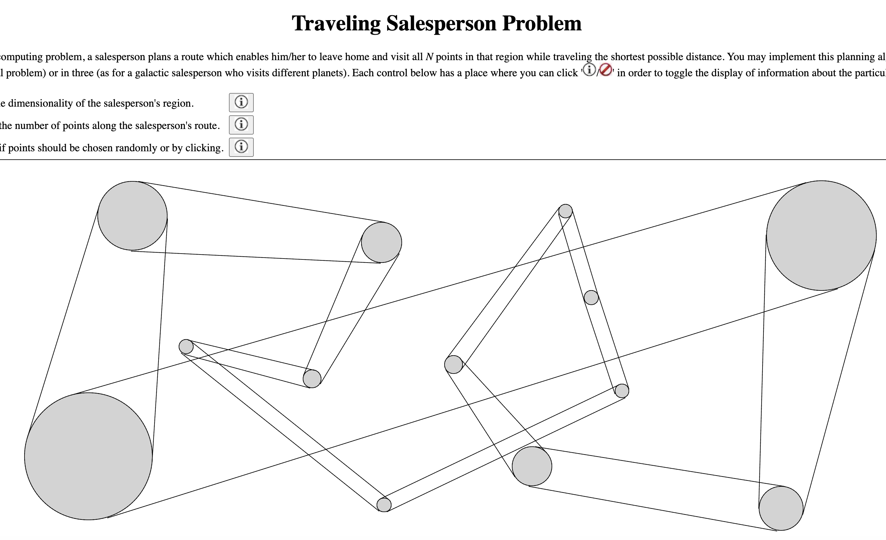

# Contents

[Heroku deployment](https://traveling-salesperson-problem.herokuapp.com)

[Geometry](#geometry)

[Outer loop (route permutations)](#outer-loop-route-permutations))

[Inner loop (towns in route)](#inner-loop-towns-in-route)

[Rendering a town/planet](#rendering-a-townplanet)

[Rendering a route](#rendering-a-route-between-two-townsplanets)

[Inputting coordinates of a town/planet](#inputting-coordinates-of-a-townplanet)

The [traveling salesperson problem](https://en.wikipedia.org/wiki/Travelling_salesman_problem) (TSP) is a classic [*NP*-hard](https://en.wikipedia.org/wiki/NP-hardness) optimization problem in computer science, in which a fixed set of points ("towns") must be connected by a path which is as short as possible. My [app](https://traveling-salesperson-problem.herokuapp.com) uses JavaScript to construct a brute-force TSP solution and which uses React to render the results.
I used this [skeleton](https://github.com/mars/create-react-app-buildpack#user-content-quick-start) for my front-end project.  Although the classic TSP involves a two-dimensional region, I've inserted the option for the user to do it for a three dimensional one, in which case I refer to the points as planets rather than towns.  The dimensionality of the problem does not affect the algorithm for determining the optimal path, but it does affect the selection of the point-coordinates and the rendering of the routes.

# Geometry

[return to "Contents"](#contents)

[go to next section ("outer loop")](#outer-loop-route-permutations)

In two dimensions, the region is simply a 1500px (= <tt>nx</tt>) x 600px (= <tt>nyz</tt>) rectangle which corresponds to most of bottom part of the screen on my computer. In three dimensions I simulate the additional dimension through standard use of [graphical perspective](https://en.wikipedia.org/wiki/Perspective_graphical) when rendering both the planets and the paths between them.  Put simply: "Objects closer to the viewer appear larger."  The three-dimensional region consists of a pyramidal [frustum](https://en.wikipedia.org/wiki/Frustum) whose base coincides with the aforementioned two-dimensional region, and whose interior extends towards the viewer who is 600px (= <tt>nyz</tt>) away from the base.  If the pyramid had an apex, it would coincide with the viewer's eyeball.  Instead, the top 20px (= <tt>zMin</tt>) of the pyramid is sliced off (thereby making it a frustum).  Planets closest to the viewer are hence simulated to be 20px away, where they appear to have a large - but finite - diameter.  The use of the region's pyramidal shape ensures that no planet contained therein will be outside of the range of the user's vision.  In other words, all of the region's
 planets must appear on the computer screen.

In my code all coordinates are non-negative. Capital <tt>X</tt> and <tt>Y</tt> represent the *apparent* lateral positions of the centers each of the planets. Zero values for each of these correspond to the left and the top of the screen region, respectively, and increasing values for each of these corresponds to the directions right and down (the screen), respectively. I use lower-case <tt>x</tt>, <tt>y</tt>, and <tt>z</tt> to represent the *absolute* (ie, non-apparent) coordinates of each of the planets.  <tt>z</tt> = 0 corresponds to the user's eyes, and increasing <tt>z</tt> corresponds to moving away from the user.  The code below shows both the relationship between absolute coordinates (<tt>x</tt>, <tt>y</tt>, <tt>z</tt>) and apparent coordinates (<tt>X</tt>, <tt>Y</tt>) and also the way that the planet coordinates are confined inside the pyramidal frustum when those coordinates are chosen randomly.  (Later I'll discuss how planet coordinates may be chosen *non*randomly.)

```
const setTowns = (n, nx, nyz, zMin, dim) => {
    // randomly create the coordinates of the towns to be visited by salesperson
    const xs = [];
    const ys = [];
    const zs = [];
    while (xs.length < n) {
        const x = Math.floor(nx * Math.random());
        const y = Math.floor(nyz * Math.random());
        // For 2-d case (dim = 1), constrain towns to be along base of pyramid.
        const z = zMin + Math.floor(nyz * (dim === 1 ? 1 : Math.random()));
        const ix = xs.indexOf(x);
        const iy = ys.indexOf(y);
        const iz = zs.indexOf(z);
        // Include a point only if it does not coincide with an existing one.
        if (ix === -1 || iy === -1 || iz === -1 || ix !== iy || ix !== iz) {
            // (nx/2, ny/2) represent the center of the screen.
            // Transformation from absolute (x,y,z) to apparent (X, Y) coordinates.
            // Note that the lateral coordinate's deviation from screen-center is inversely proportional to z.
            let X = nx/2 + nyz * (x - nx/2)/z;
            let Y = nyz/2+ nyz * (y - nyz/2)/z;
            // Only include points within the viewing region.
            if (0 <= X && 0 <= Y && X < nx && Y < nyz) {
                xs.push(x);
                ys.push(y);
                zs.push(z);
            }
        }
    }
    return xs.map((x, i) => [x, ys[i], zs[i]]);
}
```
# Outer loop (route permutations)

[return to "Contents"](#contents)

[go to previous section("geometry")](#geometry)

[go to next section ("inner loop")](#inner-loop-towns-in-route)

Any non-approximate TSP solution must consider each of the *n*! possible paths (or "itineraries").
Below is my iterative calculation of this factorial.
```
let newFacPerm = 1;
for(let i = 1; i <= n; i ++) newFacPerm *= i;
setFacPerm(newFacPerm);
```
Central to the solution's validity is the ability to enumerate the *n*! itineraries, as I do in the following for-loop.
```
// loop over all permutations (ie, all possible itineraries)
    for(let iterPerm = iterPermI; iterPerm < facPerm; iterPerm ++){
```
A key part of this algorithm is the determination of the distance between adjacent towns along the itinerary, which involves the Pythagorean theorem.  Rather than implementing this calculation (which involves a square root) a large number [= *O*(*n*!)] of times, I perform it only  *n*<sup>2</sup> times at the beginning of the calculation, filling up a lookup table in the process for later use.
```
const lookup = xyzs => {
    const distance=(x0,x1,y0,y1,z0,z1)=> Math.sqrt((x1-x0)**2+(y1-y0)**2+(z1-z0)**2);
    const interTownDistances = [];
    for (const xyz0 of xyzs) {
        const row = [];
        for (const xyz1 of xyzs) row.push(distance(xyz0[0], xyz1[0], xyz0[1], xyz1[1], xyz0[2], xyz1[2]));
        interTownDistances.push(row);
    }
    return interTownDistances;
}
```
In the loop, <tt>iterPermI</tt> is the initial (<tt>I</tt>) permanent (<tt>Perm</tt>) value of the iteration (<tt>iter</tt>) variable, which is 0 when the loop starts.  On each occasion that the algorithm finds a path-length which is smaller than any previously found, the loop is broken so that the best itinerary (<tt>itin</tt>) found thus far can be rendered, and this necessitates the reassignment of the (next) initial value of the iteration variable <tt>iterPerm</tt>, in preparation for the next entry to the all-important loop (which actually is an outer loop).
```
if (distanceTot < distanceMin[0]) {
    // Replace the existing itinerary with the current one
    setItin(newItin);
    setDistanceMin([distanceTot, ...distanceMin]);
    setNextIterPermI(iterPerm + 1);
    setMemo(newMemo);
    break;
}
```
# Inner loop (towns in route)

[return to Contents](#contents)

[go to previous section ("outer loop")](#outer-loop-route-permutations)

[go to next section ("rendering a town")](#rendering-a-townplanet)

The <tt>Perm</tt> suffix reflects the fact that I need to mutate a copy (<tt>iter</tt>) of this variable  in order to construct each unique itinerary.  My process for constructing the itinerary is to express the value of the iteration variable <tt>iterPerm</tt> in the [factorial number system](https://en.wikipedia.org/wiki/Factorial_number_system), which is sometimes called "factorial base" or "factoradic".  Each <tt>digit</tt> of this factorially-based representation of <tt>iterPerm</tt> is then used to splice the index of a particular town from a working array <tt>range</tt>, whose initial value is simply [0, 1, 2, ..., *n* - 1].  This involves the inner (backwards running) loop shown below (minus some memoization, which I'll described soon).
```
    let iter = iterPerm; // a copy which'll get mutated in the following loop
    let range = new Array(n).fill(0).map((blah, i) => i); // = [0, 1, 2, ..., n - 1]
    let fac = facPerm; // copy of n! which'll get mutated in following loop
    let newItin = [];
    // determination of digits (most significant first) of factorial-base representation of iterPerm
    for(let place = n - 1; place >= 0; place --){
        let i = n - 1 - place;
        fac /= (place + 1); // replace n! by (n-1)!
        let digit = Math.floor(iter/fac); // next digit in factorial representation
        let index = range.splice(digit,1)[0]; // next town index in itinerary
        newItin.push(index);
        distanceTot += interTownDistances[indexLast][index]];
        iter -= digit * fac; // mutate iter before getting the next factorially-based digit
        indexLast = index; // keep track of the indices of the two towns to be connected
    }
```
As an example of transforming a number from base-10 to the factorial base,
consider the case of the factorially-based representation of "fifteen".

15<sub>10</sub> = 2 * 6 + 1 * 2 + 1 * 1 + 0 * 1 = 2 * 3! + 1 * 2! + 1 * 1! + 0 * 0! = 2110<sub>!</sub>.

In order to use this representation to construct a unique permutation of <tt>range</tt> = [0, 1, 2, 3], successively splice <tt>range</tt> at these indices (2, 1, 1, and 0) and accumulate the output to get 2130.
While there are several other ways to enumerate permutations, the advantage to using the factorial number system is that the resulting array of itineraries is automatically ordered.  For instance the array of 24 permutations of 0123 would be returned as [0123, 0132, 0213, ..., 3201, 3210].  The advantage of this ordering is that there is a high probability that adjacent itineraries in this list'll include a sub-route in common, and this likelihood of commonality means that some parts of the calculation of the total distance for a particular itinerary can be memoized through the use of a slightly nested array whose length is *n*.  Below is the part of the code from above which now includes this memoization.
```
// same code as above, except that areSame is initialized as true before inner loop
    newItin.push(index);  // from code listed above
    areSame = areSame && memo[i] && memo[i][0] === index; // update boolean which dictates memo usage
    // ... if existing element in memo cannot be used, then reassign it
    if (!areSame) memo[i] = [index, distanceTot + interTownDistances[indexLast][index]];
    distanceTot = memo[i][1];
    iter -= digit * fac; // remaining lines are same
    indexLast = index
}
```
As mentionned previously, each time the outer loop encounters a new minimum in the path length, it breaks out of the loop in order to render the route before returning to the loop to look for further improvements.  In addition to rendering the route, the code also displays the newly discovered minimum distance at the end of the list of corresponding values for previous candidates.  Despite the fact that these re-renders occur at a particular frequency, for larger *n* that frequency is low enough that the browser complains, sending an alert that the page is nonresponsive.  In order to avoid this and to otherwise create a better user experience, I've installed an additional break in the loop every time that the percentage of routes checked equals an exact tenth of a percentage point (which usually occurs frequently enough that the browser does not complain).
```
// Break in order to display the next 0.1% of progress.
// Before both loops, I defined dIter as Math.round(facPerm/1000)
    if (!(iterPerm % dIter)) {
      setNextIterPermI(iterPerm + 1);
      break;
    }
```
# Rendering a town/planet

[return to "Contents"](#contents)

[go to previous section ("inner loop")](#inner-loop-towns-in-route)

[go to next section ("rendering a route")](#rendering-a-route-between-two-townsplanets)

Towns/planets are rendered as circles with the following css.
```
.dot {
    box-sizing: border-box;
    border: solid 1px black;
    position: absolute;
    border-radius: 50%;
}
```
Their absolute positionning makes it easy to position them on the parent (positionned) element.  Coordinates and other variables are threaded to the <tt>Dot</tt> component which is rendered for each town/planet.  Actually, *two* <tt>Dot</tt> components are rendered for each planet, one for either boolean value of <tt>dashed</tt>.  Those having <tt>dashed</tt> = <tt>false</tt> have a negative <tt>zIndex</tt> whose absolute value equals <tt>z</tt>, so planets closer to the viewer will obscure those farther away.  Those having <tt>dashed</tt> = <tt>true</tt> are transparent and have zero <tt>zIndex</tt> value, which - because zero exceeds any negative value - means that it will not get obscured by any planet.  The net effect of this is that there will always be a dashed line which indicates the boundary of the planet, even if it is behind another planet.  The apparent diameter <tt>d</tt> of each planet is inversely proportional to <tt>z</tt>, thereby providing perspective.
```
const Dot = ({ x, y, z, d, nx, nyz, dashed}) => {
    // convert fixed diameter to its z-dependent one
    d = nyz * d / z;
    // convert from absolute lateral coordinates to apparent lateral coordinates for rendering purposes
    let X = nx/2 + nyz * (x - nx/2)/z;
    let Y = nyz/2+ nyz * (y - nyz/2)/z;
    return (
        <div className="dot" style={{
            width:`${d}px`,
            height:`${d}px`,
            // positions must be offset by d/2 because boxes are positionned by upper-left corner.
            left: `${X - d / 2}px`,
            top: `${Y - d / 2}px`,
            // if dashed == true, this will ALWAYS render, as a dashed circle
            // if dashed == false, this will only render if nothing is above it
            zIndex: `${dashed ? 0 : -z}`,
            backgroundColor: `${dashed ? "transparent" : "lightgray"}`,
            borderStyle: `${dashed ? "dashed" : "solid"}`
        }}/>
    )
}
```
# Rendering a route between two towns/planets

[return to "Contents"](#contents)

[go to previous section ("rendering a town")](#rendering-a-townplanet)

[go to next section ("inputting coordinates")](#inputting-coordinates-of-a-townplanet)

The rendering of the path between planets by the <tt>Line</tt> component is a bit trickier.  In order to contribute to the sense of perspective, I need to use two non-parallel lines to connect planets which are adjacent in the itinerary. The simplest way to bestow these line-pairs with the same sense of perspective as has been bestowed upon the planets is to make each line (in the pair) tangent to opposite sides of the each planet in the pair. I do this through the use of trigonometry and the css <tt>transform</tt> attribute.  The <tt>which</tt> prop is a boolean that controls which of these two lines I am considering.  When combined with the <tt>dashed</tt> prop described for the <tt>Dot</tt> component, this leads to a total of four instances of the <tt>Line</tt> component for each planet.  With regards to proper use of <tt>zIndex</tt>, I had to settle for a compromise.  Ideally each pixel of the the line would have a different <tt>zIndex</tt> (in light of the fact that it is not parallel to the screen for the 3-dimensional case), but any single component can have one value of <tt>zIndex</tt>.  Accordingly, I set this to be the average values of <tt>zIndex</tt> for the two connected planets.  The result is quite satisfactory.
```
const Line = ({ xi, yi, zi, xf, yf, zf, d, which, nx, nyz, dashed }) => {
    // apparent diameters of planets at either end of line
    let di = nyz * d * (which ? 1 : -1) / zi;
    let df = nyz * d * (which ? 1 : -1) / zf;

    //convert from actual lateral coordinates to apparent later coordinates
    let Xi = nx/2 + nyz * (xi - nx/2)/zi;
    let Yi = nyz/2+ nyz * (yi - nyz/2)/zi;
    let Xf = nx/2 + nyz * (xf - nx/2)/zf;
    let Yf = nyz/2+ nyz * (yf - nyz/2)/zf;

    // I choose the offset (0.5) so that the lines will be tangent to the planets
    let offi = di / 2;
    let offf = df / 2;
    let doff = offf - offi;
    // The following two lines represent the two sides of a right triangle.
    const dX = Xf - Xi;
    const dY = Yf - Yi;

    // Pythagorean theorem
    const R = Math.sqrt(dX * dX + dY * dY);
    const R2= Math.sqrt(R*R - doff * doff);
    // "TOA" part of "SOHCAHTOA", but for two angles
    let angle = Math.atan2(dY, dX);
    const angle2 = Math.atan2(doff, R2);
    angle -= angle2;
    return (
        <div className="line" style={{
            width:`${R2}px`,
            left: `${Xi - R2 / 2 + (di / 2) * Math.sin(angle)}px`,
            top: `${Yi - (di / 2) * Math.cos(angle)}px`,
            transform: `rotate(${angle * 180 / Math.PI}deg) translateX(${R2 / 2}px)`,
            borderTopStyle: `${dashed ? "dashed" : "solid"}`,
            zIndex: `${dashed ? 0 : -(zi + zf) / 2}`
        }}/>
    )
}
```
# Inputting coordinates of a town/planet

[return to "Contents"](#contents)

[go to previous section("rendering a route")](#rendering-a-route-between-two-townsplanets)

The app has three inputs.  The first is a straightforward binary choice: 2-dimensional or 3-dimensional.  The second is also straightforward: specifying the value of *n*.  The third is also a straightforward binary choice: specifying whether the planet coordinates should be random or whether the user should pick by them.  If the user chooses "random", then there is nothing else to do except click <tt>Start</tt>.  However if the user chooses "pick" then he/she must use the mouse to pick coordinates.  How this is done depends upon whether the user has chosen 2-d or 3-d.

Either case requires the user to click various locations on screen in order to choose town/planet coordinates (instantly rendering a new circle in each case).  Below are shown the lines of code from the mouseDown event-handler required for recording the coordinates for the 2-d case.  Note that - in the 2-d case - each town's <tt>z-</tt> coordinate is set at <tt>nyz</tt>, which corresponds to the "altitude" of the computer screen (from the user's eye).
```
const handleDown = e => {
    // disable event listener when enough points have been clicked
    if (xyzs.length === n + 1) return;
    let newXyzs = [[e.nativeEvent.offsetX, e.nativeEvent.offsetY, nyz], ...xyzs];
    setXyzs(newXyzs);
    setInterTownDistances(lookup(xyzs));
}
```
It is trickier to enable the user to specify the <tt>z-</tt> coordinate for the 3-d case.  I opted to accomplish this by allowing a decrease of <tt>z</tt> to mirror the passage of time.  Specifically, the app measures the amount of time that the user presses the mouse down (before releasing it), and that sets the amount that <tt>z</tt> decreases (in px) from its maximum possible value (<tt>nyz</tt>) to equal the number of ms that the mouse was depressed, but preventing the <tt>z</tt>-value from ever bringing the planet too close to the user.  This requires three things:
1) For best user experience, the mouseDown event-handler must measure apparent lateral coordinates (<tt>X</tt>, <tt>Y</tt>) as opposed to actual lateral coordinates (<tt>x</tt>, <tt>y</tt>).  (Otherwise the planet's apparent lateral position will change while the button is depressed, which is very distracting.)
2) A useEffect equipped with a setInterval invocation measures time since the mouseDown and continuously adjusts <tt>z</tt> (and <tt>x</tt> and <tt>y</tt>) for the new planet.
3) A mouseUp event-handler stops the timing process for each planet.
Below are these three pieces of code, modified as described above but also with a few other adjustments.
```
const handleDown = e => {
    // disable event listener when enough points have been clicked
    if (xyzs.length === n + 1) return;
    setDown(true);
    // following two setters are for apparent - not actual - lateral position
    let newX = e.nativeEvent.offsetX;
    let newY = e.nativeEvent.offsetY;
    setX(newX);
    setY(newY);
    // The point should start at the most distant location, if this is 3-d.
    setZ(nyz);
    // This will render the new planet during the mouse depression.
    setXyzs([[newX, newY, nyz], ...xyzs]);
}
```
2)
```
useEffect(() => {
    let interval = null;
    if (down) {
      let x = nx / 2 + z * (X - nx / 2) / nyz;
      let y = nyz / 2 + z * (Y - nyz / 2) / nyz;
      setXyzs([[x, y, z], ...xyzs.slice(1)]);
      // the z-coordinate will decrease by 1 px w/each passing ms.
      interval = setInterval(() => {
        setZ(z => Math.max(z - (dim === 1 ? 0 : 1), zMin));
      }, 1);
    } else if (!down && z !== nyz) {
      clearInterval(interval);
    }
    return () => clearInterval(interval);
}, [down, z, X, Y, dim]);
```
3)
```
const handleUp = e => {
    setDown(false);
    setInterTownDistances(lookup(xyzs));
}
```
The resulting mechanism is very easy to use.

[return to "Contents"](#contents)

[return to beginning of this section ("inputting coordinates")](#inputting-coordinates-of-a-townplanet)
